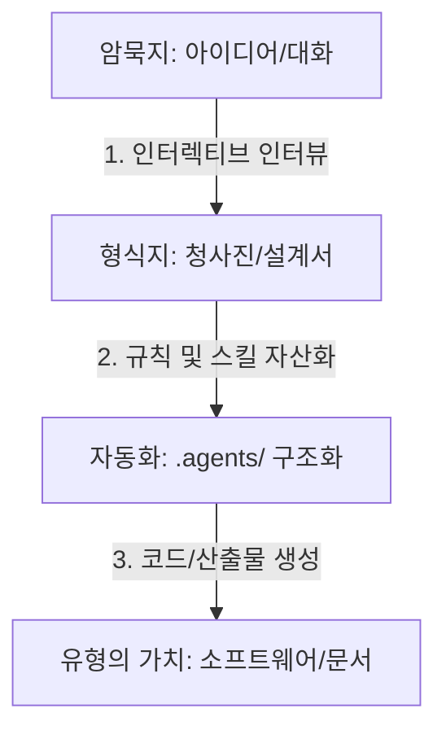

# Antigravity 프로젝트 지식 저장 및 자산화 가이드

프로젝트 초기 단계의 **암묵지(Tacit Knowledge, 머릿속의 아이디어나 파편화된 기획)**를 체계화하여 **형식지(Explicit Knowledge)이자 유형의 가치 있는 결과물(코드, 문서, 구조)**로 구체화하는 지식 아카이빙 프로세스 가이드라인입니다.

---

## 1. 지식 수집 및 아카이빙 단계별 흐름

### 1단계: 암묵지 수집 및 인터뷰 자동화 (수집)
* **대화형 인터뷰 및 기획 수집:** 기획서가 명확하지 않은 상태에서는 에이전트와의 인터랙티브 대화(`/grill-me` 등)를 통해 설계 아이디어를 조립합니다.
* **사용자 의도 아카이빙:** 사용자가 던지는 조각난 텍스트나 개발 스케치를 한데 모아 '지식 스케치' 로그로 먼저 보관합니다.

### 2단계: 구조화 및 청사진(Blueprint) 변환 (구조화)
* **아티팩트(Artifact) 활용:** 대화 맥락을 기반으로 `blueprint.md`, `system_architecture.md`, `user_stories.md` 등 구조화된 분석 문서를 실시간 생성합니다.
* **지식 저장소 아카이브 (.agents/knowledge/):** 프로젝트 내에 전용 지식 저장 공간을 마련하여 설계 결정 과정(ADR)이나 변경 사유를 기록 및 축적합니다.

### 3단계: 지식의 자산화 및 자동화 (자산화)
* **프로젝트 규칙(.agents/rules/) 개발:** 분석된 컨벤션과 코딩 스타일을 규칙 파일로 명시하여 에이전트의 개발 기준을 수립합니다.
* **커스텀 스킬(.agents/skills/) 개발:** 반복 작업 및 프로젝트 고유 코딩 패턴을 에이전트 스킬로 구현하여 개발 속도를 자동화합니다.

---

## 2. 지식 저장 및 구조화 명령어 가이드

지식을 에이전트와 함께 효율적으로 수집하고 아카이빙할 때 사용하는 핵심 명령 패턴입니다.

### ① 기본 내장 슬래시 명령어
* **`/grill-me` (인터뷰 모드):**
  * 기획 아이디어의 모호한 부분을 에이전트가 꼬리 질문을 던져 정교하게 구체화해 줍니다.
* **`/plan` (계획 및 설계 수립):**
  * 수집된 컨셉을 바탕으로, 코드 구현 전에 구현 단계별 상세 시나리오가 적힌 설계 아티팩트(Blueprint)를 생성합니다.
* **`/goal` (장기 자산화):**
  * 다단계 프로세스를 자율적으로 검증하고 반복 수행하여 하나의 대단위 목표를 달성하게 만듭니다.

### ② 사용자 커스텀 자동화 명령어
* **`"새로운 프로젝트로 등록해줘"`:**
  * 현재 열어 둔 프로젝트 루트 폴더에 `.agents/knowledge/`를 포함한 4대 기본 폴더를 자동 생성하고 전역 프로젝트 이력으로 자동 등록합니다.

### ③ 실시간 아카이빙 지시어 (Prompting)
대화 도중 도출된 지식을 `.agents/`로 이관하기 위해 다음과 같이 지시할 수 있습니다.
* *"지금 대화에서 도출된 핵심 설계 의사결정을 `.agents/knowledge/` 폴더에 ADR 문서로 아카이빙해줘."*
* *"방금 합의한 네이밍 컨벤션을 `.agents/rules/naming_rules.md` 파일로 정리해줘."*
* *"방금 해결한 라이브러리 버전 충돌 원인과 해결법을 `.agents/knowledge/troubleshooting.md`에 보관해줘."*

---

## 3. 지식 저장소 아카이브(`.agents/knowledge/`) 활용 템플릿

이 디렉터리 내에 축적되는 지식 문서들은 다음과 같은 템플릿을 사용하여 관리할 수 있습니다.

### 아키텍처 결정 기록 (ADR: Architecture Decision Record) 예시
* **파일명:** `ADR-0001-state-management.md`
* **템플릿 구조:**
  1. **제목(Title):** 결정된 주제
  2. **맥락(Context):** 해결해야 하는 문제와 기술적 대안들
  3. **결정(Decision):** 최종 채택된 방안 및 이유
  4. **결과(Consequences):** 이 결정으로 인한 영향도 및 제약 사항
